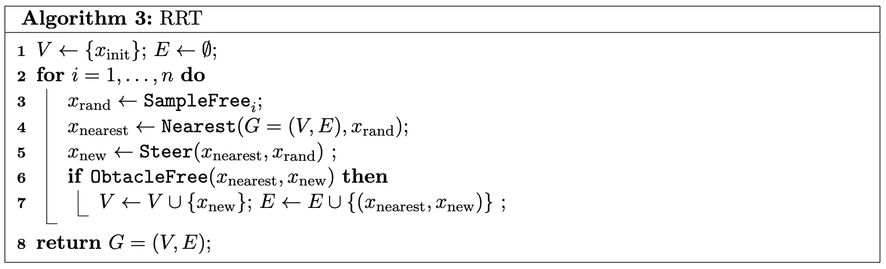
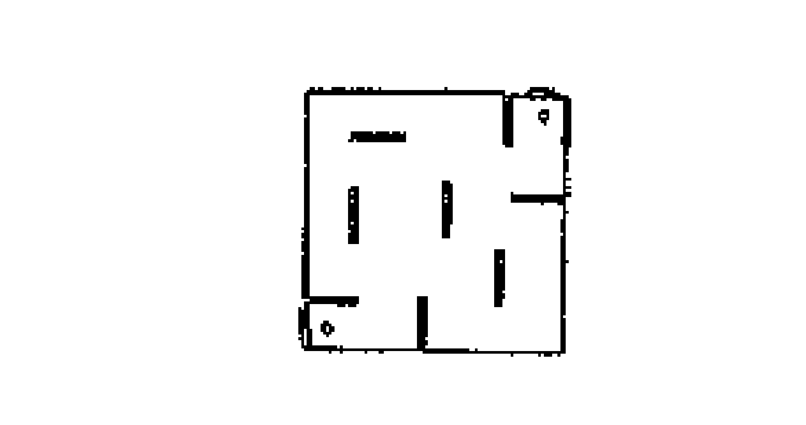
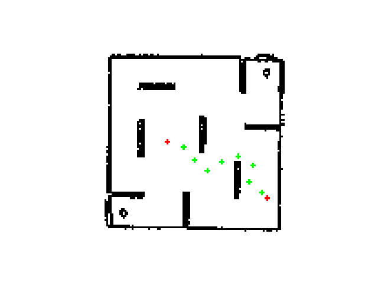
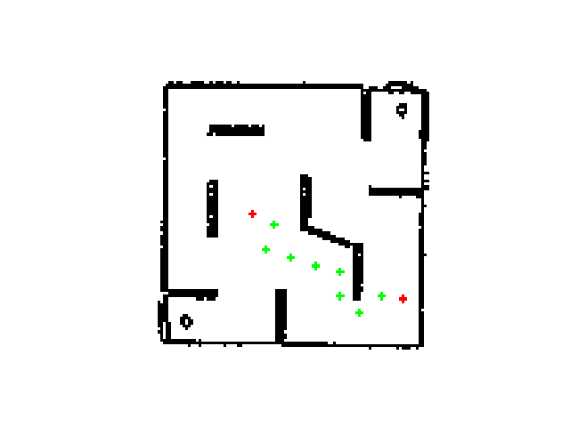

# RRT

***This assignment is to be done as individuals, not with partners nor with teams.***

### How to get started →

Begin by reading this entire writeup and making sure you have a good understanding of it. Take note of the topics in the resources section as your questions might already be covered there. You should aim on identifying what features you need to implement, which ROS nodes and topics you’ll need and how you’ll test and evaluate your package.

---
# Introduction

Rapidly-Exploring Random Trees (RRT) is a path-planning algorithm widely used in robotics for efficiently navigating complex and high-dimensional spaces. It incrementally builds a tree of feasible paths from the robot's start position toward the goal by sampling random points and connecting them with valid trajectories. RRT is particularly effective in environments with obstacles or constraints, making it a robust choice for motion planning in both static and dynamic scenarios.

In this assignment, you will be implementing a RRT planning and navigation pipeline for the turtlebot3 and combining your it with your implementation of the goal-seek behaviour from the class activity.



---
# Assignment Information

Your algorithms/methods must be implemented on a simulated turtlebot3 (burger model) in the gazebo simulation that was used in the navigation programming assignment (PA2). You will be implementing a complete pipeline of planning and navigation of the turtlebot.  
Begin by cloning this repository in the src directory of your catkin workspace and building it with catkin after you create an empty src directory inside. This repository is a ROS package that contains.

### Objectives

- Integrate graph planning approach for a real robot
- Apply appropriate control for the generated set of waypoints

### Resources

- RRT - [Video](https://www.youtube.com/watch?v=Ob3BIJkQJEw)

### Requirements

- Your package should build when simply dropped into a workspace and compiled using `catkin build`
- Your launch file should execute and launch the simulator and your node
- Your package, nodes and launch files should follow the naming convention, if your code does not work due to the filenames being incorrect, you will receive zero points 

### What we provide
- `map.npy` - 2D grid representation of stage 4
- `src/ablate.py` - Python code to add circles and lines to map for testing purposes


### What to submit


```bash
rrt
├── launch
│   └── rrt.launch # Should launch the sim, 
                   #calculate path and start navigating
├── config
│   └── params.yaml 
├── src # All your scripts go here
├── map
│   └── map.npy # Grid to perform RRT on
├── package.xml
└── CMakeLists.txt
```

*Please make sure you adhere to the structure above, if your package doesn’t match it the grader will give you a **zero***

### Grading considerations

- **Late submissions:** Carefully review the course policies on submission and late assignments. Verify before the deadline that you have submitted the correct version.
- **Environment, names, and types:** You are required to adhere to the names and types of the functions and modules specified in the release code. Otherwise, your solution will receive minimal credit.

---
## Plan and Nav

You will implement graph based RRT on the stage4 turtlebot world. The same world is defined as a numpy grid called `map.npy`. Upon loading this grid you will find the following structure.



Here, the black parts indicated the location of the walls. 
The configuration file in `config/params.yaml` contains 2 parameters, `grid` indicating the location of the grid file and `goal_position` indicating the cartesian position of the goal within this grid. Upon launching the node, your robot will perform the RRT planning and navigate to the goal avoiding obstacles on the way.

>Note: While grading, a different grid pattern with pseudo obstacles will be utilized. It is recommended you add pseudo obstacles during development to ensure functionality. Standard Bug-2 will be considered as invalid.

**Goal: (2, -1.5)**




### Plan of attack (Optional)

1. Load the grid and goal position
2. Convert cartesian goal coords to (row,column) indexes for graph searching
3. Once you obtain the index path convert it back to cartesian coords
4. Perform goal seek on individual coords

# Submission and Assessment

---

Submit using the Github upload feature on [autolab](https://autolab.cse.buffalo.edu)

**Note: Make sure your code complies to all instructions, especially the naming conventions. Failure to comply will result in zero credit**

You will be graded on the following. Penalties are listed under each point, absolute values, w.r.t assignment total.

1. Plan and Nav [100%] 
    
